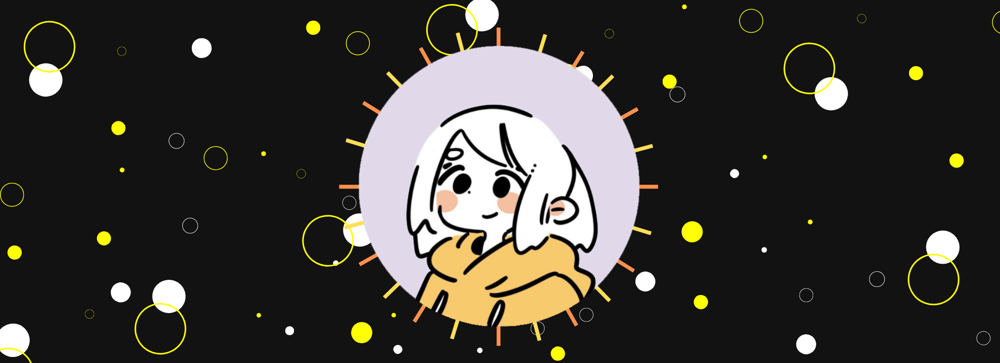

<!--
Este repositório foi inspirado por uma variedade de perfis do GitHub. Todos os créditos pelos exemplos de repositórios serão devidamente atribuídos a https://github.com/abhisheknaiidu/awesome-github-profile-readme.
============================================================================================
This repository has been inspired by numerous GitHub profiles. All credits for the repository examples will be given to https://github.com/abhisheknaiidu/awesome-github-profile-readme.
-->

<h1>
👋 Hi, I’m Sierra! Beginner developer, ENFP-T & AvGeek ✈️ 
</h1>

- 🌱 Currently, I'm on a journey of learning HTML, CSS, and Python 🚀
- 📫 How to reach me? You can DM me on [Discord](https://discordapp.com/users/916018769342648330); I'm always there and will respond promptly.
- 🎓 Infinity School Student, aspiring Full Stack Developer. 🌐
- 🔗 Connect with me on [Instagram](https://www.instagram.com/sierra.for/)!
- 😄 Pronouns: He/Him

    

| <h3>🎧 What am I listening to?</h3> | <h3>💻 What am I doing?</h3> |
|-----------------------------|---------------------|
| <a href="https://github.com/LSierra1/Spotify-Readme"> <picture> <source media="(prefers-color-scheme: light), (prefers-color-scheme: no-preference)" srcset="https://spotify-sync-teal.vercel.app/api?theme=light&scan=false&rainbow=false" /> <source media="(prefers-color-scheme: dark)" srcset="https://spotify-sync-teal.vercel.app/api?theme=dark&scan=false&rainbow=false" />  </picture> </a> |  |

  
<b>Some big GitHub stats</b>

| GitHub Stats | GitHub Streaks |
|---------------|---------------------|
|  |  |

| Top Languages | GitHub Profile Card |
|---------------|---------------------|
|  |  |

<!--

-->
